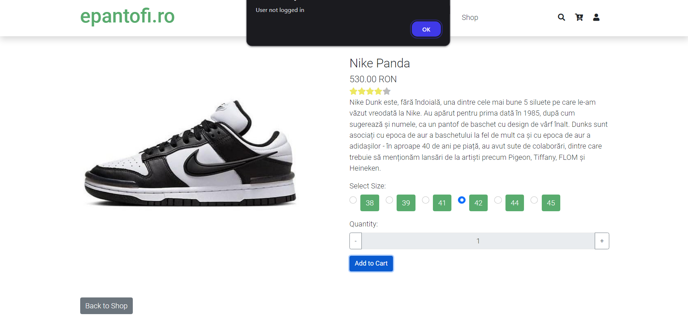

The Shoes Store  project, named ePantofi , is an e-commerce platform designed for selling shoes online. The website is built using HTML, CSS, PHP, and JavaScript , with a strong emphasis on backend functionality implemented in PHP. The database is managed using MySQL  via phpMyAdmin , and the frontend design leverages Bootstrap  for responsive layouts. Additionally, the template was initially sourced from TemplatesJungle  and heavily customized to meet the project's requirements. 
Key Features: 
User-Facing Features: 
- User Authentication : Users can create new accounts or log in with existing credentials.
- Product Display : Shoes are dynamically displayed based on data stored in the MySQL database. Each product includes: 
       - A zoomable image.
       - Available sizes, with "SOLD OUT" labels for unavailable sizes.
- Shopping Cart : Users can add or remove items from their cart and place orders. Orders can only be placed by logged-in users.
- Best-Selling Products : The homepage (index.php) showcases the most popular shoes, based on sales data from the database.
- Shop Page (shop.php) : Products are dynamically fetched from the database and displayed with filtering options such as price, brand, alphabetical order, and more.
     
Admin Panel: 
- Accessible via a unique URL and secured with a username and password.
- Admins can:
  * Add, modify, or delete products.
  * View stock levels for each shoe size.
  * View all placed orders, sorted by submission date.
         
Technologies Used: 
- Frontend : HTML, CSS (Bootstrap), JavaScript.
- Backend : PHP.
- Database : MySQL (managed via phpMyAdmin).
- Local Server : XAMPP Control Panel (Apache and MySQL services must be running).
  
How to Access the Website Locally:
- To run the website locally, access it via the following URL: https://localhost/ShoesStore/index.php (Note: The exact URL may vary depending on where the project folder is placed.)

Installation and Setup Instructions:
Prerequisites:
- XAMPP
- Git
- Web Browser : Any modern browser (e.g., Chrome, Firefox).
     
Steps to Set Up the Project: 
1. Clone the Repository: - Open a terminal and run: git clone https://github.com/sandorionut/ShoesStore.git
2. Move the Project Folder: Place the cloned project folder into the htdocs directory of your XAMPP installation: C:\xampp\htdocs\ShoesStore
3. Start Apache and MySQL: 
- Open the XAMPP Control Panel.
- Start the Apache  and MySQL  services.
4. Set Up the Database: 
- Open phpMyAdmin by navigating to http://localhost/phpmyadmin in your browser.
- Create a new database (e.g., shoes_store).
- Import the SQL file provided in the repository (usually named database.sql) to populate the database schema and tables.
- Populate the tables with relevant data (e.g., products, users, orders) as needed.
5. Access the Website :
- Open your browser and navigate to: https://localhost/ShoesStore/index.php
6. Admin Panel : 
- Access the admin panel via the designated URL (details provided in the repository).
- Log in using the unique username and password specified in the documentation.

Notes:
- Ensure that the database connection details in the PHP files match your local MySQL configuration (e.g., localhost, root, and an empty password by default).
- If you encounter any issues with file paths or URLs, adjust them according to your local environment.
     
Customizations: 
- The frontend template was sourced from TemplatesJungle  and extensively modified to include dynamic content and additional features.
- All product data is fetched dynamically from the MySQL database, ensuring flexibility and scalability.

     
     
        
